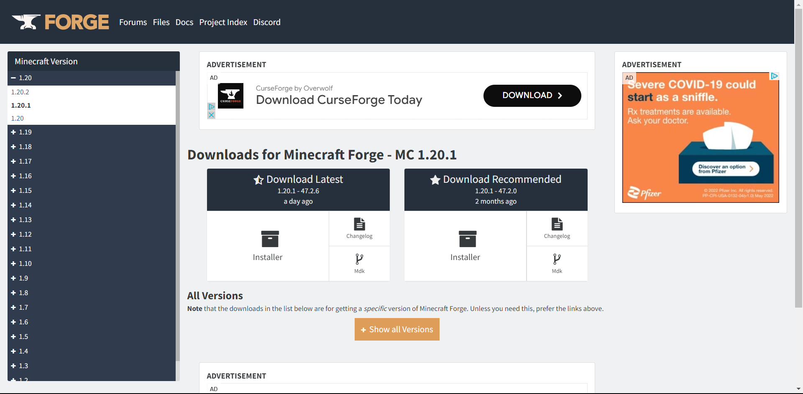
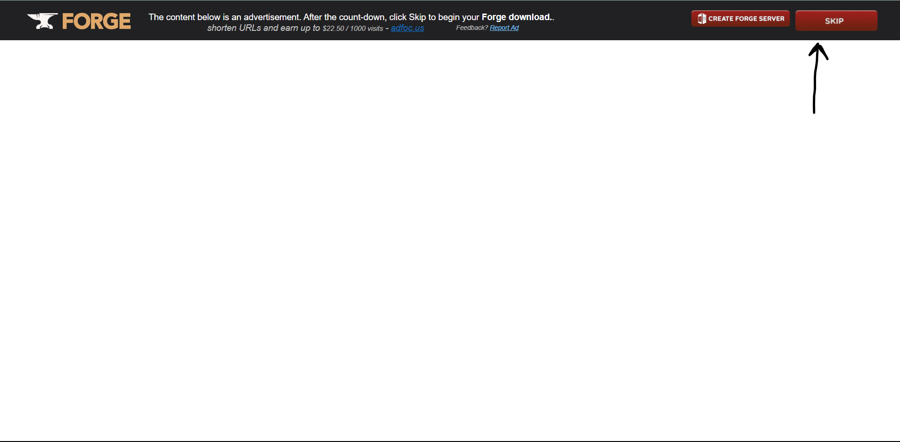

# ServerConnectionInstructions
Instructions on how to download and connect to the Homies-Craft Minecraft Server

Greetings Thanks for your intrest in playing on the homies craft minecraft server. It has been moddend and now requires the instalation of a few different things to play 

1. Click on [This Link](https://files.minecraftforge.net/net/minecraftforge/forge/) that will direct you to the Forge Minecraft website It should look like this
     
2. Look to the right hand side of the screen that says download recomended and click on the inslaller it will direct you to an adFocus page that you will have to wait 5 seconds before clicking the skip button in the top right
     

